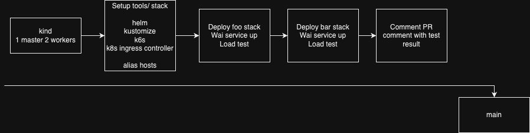

# Load testing in CI for stack on Kubernetes

## High level workflow

The workflow:
- Run on Github action runner
- Trigger: On every Pull request for `main` or `workflow_dispatch `(trigger manually)
- Steps:
    - Spin up `Kind` cluster with 1 master, 2 workers
    - Setup tools & environment
        - `helm`, `kustomize`, `k6s`
        - `Nginx ingress` using helm
        - Alias `127.0.0.1 foo.localhost bar.localhost` on CI runner
    - Deploy and test `foo` stack
        - Deploy stack using `kustomize`
        - Wait for service to be ready using `npm wait-for`
        - Run load testing script using `k6s` with code in [script](k6s/script.js) and save report in JSON format as `foo.json`
    - Deploy and test `bar` stack
        - Deploy stack using `kustomize`
        - Wait for service to be ready using `npm wait-for`
        - Run load testing script using `k6s` with code in [script](k6s/script.js) and save report in JSON format as `bar.json`
    - Post `foo.json` and `bar.json` to the Pull request that was created.

## Techstack
- CI tool: Github action
    - Reasons:
        - Code on Github, then Github action is the best choice
        - Lean configuration, easy to extend code base
    - Alternatives: Gitlab CI, CircleCI, etc
- Kubernetes: Kind
    - Reasons:
        - Lightweight but have enough features 
        - Lean configuration for a working cluster
    - Alternatives: Kubeadm, microk8s, etc (but too heavy in compute)
- k8s templating tool: Kustomize (`k8s/` for `foo` and `bar`), Helm (`nginx-ingress`)
    - Reason:
        - `kustomize`: I feel good with this tool and it's `Declarative over Imperative`
        - `helm`: For stack like `nginx-ingress`, it's well documented and tested.
- Load testing tool: `k6s`
    - Reason:
        - Tool from Grafana, can fit right into the obserbility stack that I used (Grafana - Prometheus - Loki - Tempo - k6s). We can have a performant single pane of glass for the system while keeping cost low
        - Can be easily written in Javascript/ Typescript code, can support UI test, Smoke test, Stress test, Soak tst, Spike test, API test.
    - Alternatives:
        - hey
        - locust

## Files and purposes
```
.
├── .github
│   └── workflows
│       └── pr_main.yaml # Pipeline template PR to `main`
├── docs
│   └── images
│       └── workflow.jpg
├── k6s # Script to load testing service
│   └── script.js
├── k8s
│   ├── base # Kustomize base configuration
│   │   ├── deployment.yaml
│   │   ├── ingress.yaml
│   │   ├── kustomization.yaml
│   │   └── service.yaml
│   └── overlay # Kustomize overlay configuration
│       ├── bar # Kustomize overlay configuration for `bar`
│       │   ├── deployment.yaml
│       │   ├── ingress-patch.json
│       │   └── kustomization.yaml
│       └── foo # Kustomize overlay configuration for `foo`
│           ├── deployment.yaml
│           ├── ingress-patch.json
│           └── kustomization.yaml
├── kind
│   └── config.yaml # Config for Kind cluster in localhost
└── README.md
```

## Checklist

- [x] For each pull request to the default branch (`main`), trigger the CI workflow with Github action
- [x] Provision a multi-node (1 master & 2 workers) Kubernetes cluster (Kind on CI node)
- [x] Deploy Nginx Ingress controller to handle incoming HTTP requests
- [x] Create 2 http-echo deployments, one serving a response of “bar” and another serving a response of “foo”.
- [x] Configure cluster / ingress routing to send traffic for “bar” hostname to the bar deployment and “foo” hostname to the foo deployment on local cluster (i.e. route both http://foo.localhost and http://bar.localhost).
- [x] Ensure the ingress and deployments are healthy before proceeding to the next step.
- [x] Generate a load of randomized traffic for bar and foo hosts and capture the load testing result - `k6s`
- [x] Post the output of the load testing result as comment on the GitHub Pull Request (automated the CI job). Depending on the report your load testing script generates - http request duration (avg, p90, p95, ...), % of http request failed, req/s handled.
- [ ] Setup Prometheus/ Grafana to monitor cluster/ pod level metrics: CPU, Memory, Disk, Network

## Time estimation (Total: 3.5 hours)
- Testing locally (1.5 hours)
    - Kind setup (`kind/`)
    - k6s script in `k6s/`
    - Kustomize script in `k8s/`
- Testing on Github action (1 hour)
    - Setup repo, settings (read/ write permission for posting PR comment)
    - Add workflow and test things out
- Write document and add code comment/ check for fail case (1 hour)